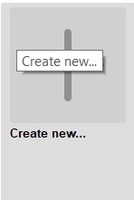
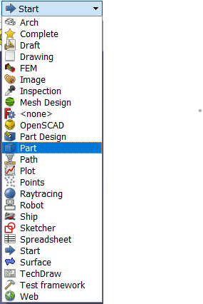
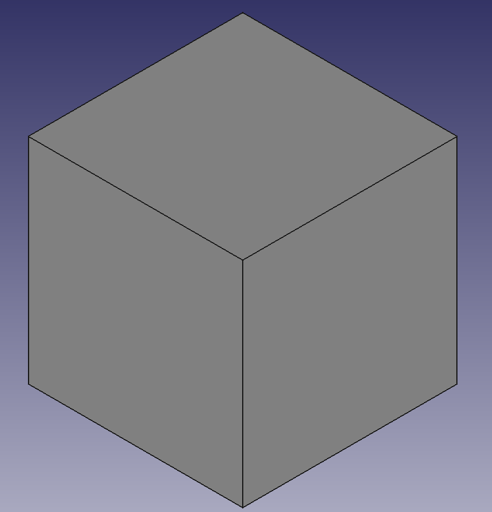
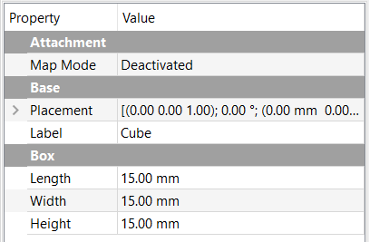

## Make the pawns and rooks

The easiest pieces to create for your Bauhaus chess set are the pawns and the rooks. This is because they are just simple cubes.

--- task ---
Open FreeCAD, then create a new project.

--- /task ---

--- task ---
Open the workbench menu, then select **Part**.

--- /task ---

--- task ---
Click on the **Create a cube solid** icon to place a cube into your project. The icon looks like this:

--- /task ---

--- task ---
The default size of the cube is 10mm x 10mm x 10mm, which is fine for the pawns. Save your file as `pawn.FCStd`.
--- /task ---

--- task ---
Now save the file again, but this time, call it `rook.FCStd`. Make sure that the cube is selected in the **Model** tab of the **Combo View**, then change the size properties so that it is 15mm x 15mm x 15mm. Your rook is now finished, so save the file, then close the project.

--- /task ---
