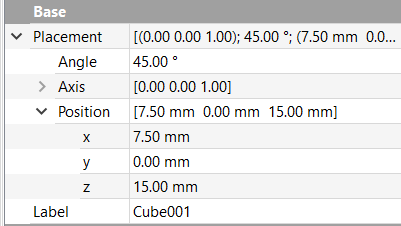

## Make the king

It is not much more difficult to make the king than to make the rook.

--- task ---
Open your `rook.FCStd` file, then save it again as `king.FCStd`.
--- /task ---

--- task ---
Click on the **Create a cube solid** icon to place an additional cube into your project.
 
--- /task ---

This new cube will be the king's head, so next, you will place it on top of the base.

--- task ---
Click on the new cube in the **Model** tab. In the **Property** tab, change the **Angle** to `45°`.

Then, change the **Position** of the cube so that it has an **x** position of `7.5mm` and a **z** position of `15mm`.

--- /task ---

If you look at the king from the top-down view, you will notice that the corners of the head do not line up with the edges of the base.

The sides of the cube need to be made longer. You can use [Pythagoras' theorem](https://en.wikipedia.org/wiki/Pythagorean_theorem){:target="_blank"} to work out what the dimensions of the cube should be:

The sum of the square of the length of the two blue lines is equal to the square of the length of the red line.

or

You know that the length of the blue lines is half the width of the cube, so you can do the following calculation:

This gives a length for the red line of just over 10.6mm.

--- task ---
Change the cube's **Length**, **Width**, and **Height** to `10.6mm`.

--- /task ---

--- task ---
Finally, you need to turn the king into a single object.

Select both cubes in the **Model** tab, then click on the **Make a union of several shapes** icon.

--- /task ---

