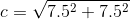

## The King

The king is not much more difficult to make than the rook.

--- task ---
Open up your `rook.FCStd` file, and save it again as `king.FCStd`
--- /task ---

--- task ---
Use the *Create a cube solid* icon to place an additional cube into your project
 
--- /task ---

This new cube will be the king's *head*, so it needs to be placed on top of the base.

--- task ---
Click on the new cube in the **Model** tab and then in the **Property** tab change the `angle` to `45°`

Then change the position of the cube so that it has an `x` position of `7.5mm` and a `z` position of `15mm`

--- /task ---

If you look at the king from the top-down view, you'll notice that the corners of the head do not line up with the edges of the base.

The length of the sides of the cube need to be increased. You can use [Pythagoras' theorem](https://en.wikipedia.org/wiki/Pythagorean_theorem) to calculate the required dimensions of the cube.

The sum of the square of the length of the two blue lines is equal to the square of the lenght of the red line.

or

As you know the lenght of the blue lines are half the width of the cube, you can do the following calculation.

Which gives a length for the red line of just over `10.6mm`

--- task ---
Edit the cubes length, width and height, so that they are all 10.6mm

--- /task ---

--- task ---
To finish off, you need to turn the king into a single object.

Select both cubes in the **Model** tab and then click on the **Make a union of several shapes** icon.

[Part_Fuse](images/Part_Fuse.png)
--- /task ---

