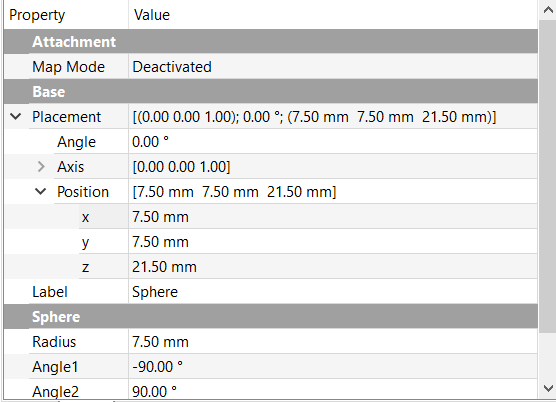

## Make the queen

--- task ---
Open the `rook.FCStd` file again, then save it as `queen.FCStd`.
--- /task ---

--- task ---
Now, click on the **Create a sphere solid** icon to add a sphere to your project.

--- /task ---

--- task ---
Now, you need to place the sphere on top of the cube base.
Change the **Position** of the sphere so that it has an **x** position of `7.5mm`, a **y** position of `7.5mm`, and a **z** position of `21.5mm`. Then, change the **Radius** of the sphere so that it is also `7.5mm`.

--- hints --- --- hint ---
To change these properties, click on the sphere in the **Model** tab, then edit the values in the **Property** tab.
--- /hint --- --- hint ---
This is what the properties of the sphere should look like:

--- /hint --- --- /hints ---
--- /task ---

--- task ---
Use the same technique as in the previous step to fuse the sphere and the cube into a single piece.
--- /task ---
