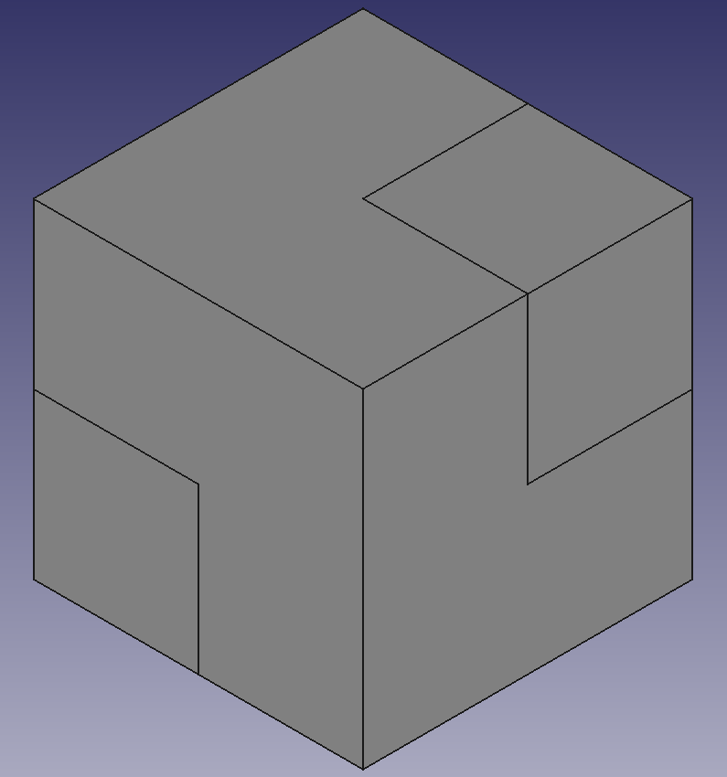

## Make the knights

--- task ---
First, place a `15mm` x `15mm` x `15mm` cube into your project.
--- /task ---

Next, you will cut two corners out of the cube, so that each face looks like an 'L'.

--- task ---
Add another cube into your project. Set its dimensions to `7.5mm` x `7.5mm` x `7.5mm`.

Add a third cube with the same dimensions, but set its **Position** to `7.5mm` on each of the **x**, **y** and **z** axes.

--- /task ---

--- task ---
Now, join the two smaller cubes together. As you did before, select both cubes (if you haven't renamed them, the cubes will be called `Cube001` and `Cube002`), then click on the **Make a union of several shapes** icon to make them into a single object.

--- /task ---

--- task ---
To finish the knight, select the `Cube` and `Fusion` objects in the **Model** tab, then click on the **Make a cut of two shapes** icon.

--- /task ---
