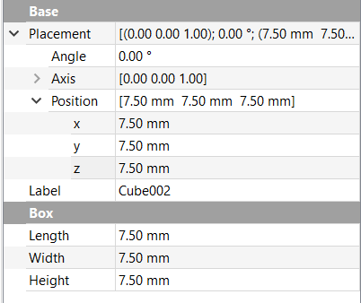

## Knights

--- task ---
For the knight, start by placing a `15mm` x `15mm` x `15mm` cube into your project.
--- /task ---

The knight needs two corners to be cut away, leaving an **L** like shape when viewing any of the six faces.

--- task ---
Add another cube into your project, and set it's size to be `7.5mm` x `7.5mm` x `7.5mm`.

Add a third cube with the same dimensions but set it's position to `7.5mm` on each of the `x`, `y` and `z` axes.

--- /task ---

--- task ---
Now you need to join the two smaller cubes together. As before, select them both (`Cube001` and `Cube002` if you haven't renamed them), and then use the **Make a union of several shapes** tool to turn them into a single object.

--- /task ---

--- task ---
To finish off the rook, select the `Cube` and `Fusion` objects in the **Model** tab, and use the **Make a cut of two shapes** tool.

--- /task ---
