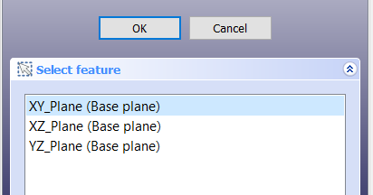
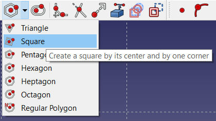
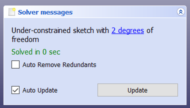
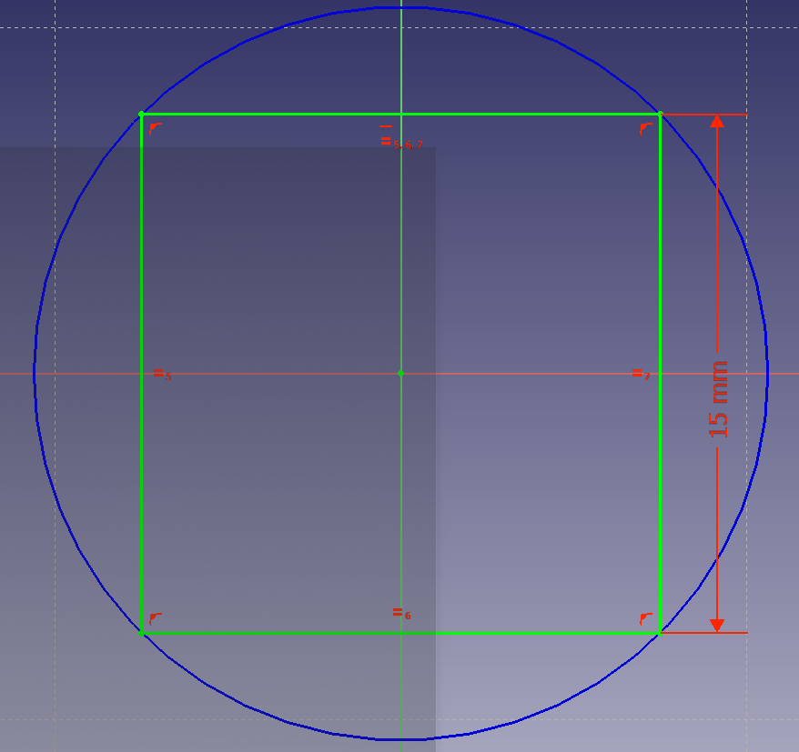

## Make the bishops

The bishops are the most difficult pieces to make. Instead of trying to make them out of primitive pieces, you will use a **Sketch** to describe the shape, then turn this into a 3D piece.

--- task ---
Create a new file, then go to the workbench menu and select **Part Design**.

--- /task ---

--- task ---
Click on the **Create a new body and make it active** icon, then click on the **Create a new sketch** icon.

--- /task ---

--- task ---
You will be prompted to select a plane, onto which your new sketch will be mapped. Select the **XY_Plane**, then click on **OK**.

--- /task ---

Your workbench will now change to the **Sketcher** workbench.

First, you will make a **Construction Geometry**. Think of this as a guideline to help you draw an accurate sketch.

--- task ---
To start, click on the **Create a square by its center and by one corner** icon.

Hover your cursor over the centre of the XY_Plane, so that the red dot in the middle turns yellow.

Then, click on the yellow dot and drag outwards to draw a square. This square will be bound to the centre of the plane.

--- /task ---

Next, you will add some **constraints** to the sketch. This will ensure that it is positioned and orientated correctly, with a defined size. 

Look at the **Tasks** tab. You will see that the square already has some constraints on it.

Most of these constraints relate to the nature of a square. For example, opposite sides must be parallel and all sides must have the same length. You added one more constraint when you made sure that the square was in the centre of the plane.

In the **Tasks** tab, you will also see that your square has **2 degrees of freedom**.

This means that you need two additional constraints to fully define the square.

--- task ---
Click on an edge of the square and drag it around. You should see that the square can rotate.

Click on any of the square's edges, then click on the **Create a horizontal constraint in the selected item** icon.

Now, the square can't rotate anymore.
--- /task ---

--- task ---
If you click on an edge and drag it around now, the square will resize.

Click on a vertical edge, then click on the **Fix the vertical distance between two points or line ends** icon. (It may be in the drop-down menu for the constraints.) Set the **Length** of the edge to `15mm`.

--- /task ---

You should see that your square has turned green, and in the **Tasks** tab, there should be a message that says that the sketch is fully constrained.

--- task ---
To turn this square into a construction geometry, select each of the edges and click on the **Toggle construction geometry** icon.

--- /task ---

The square will turn blue.

--- task ---
Use the **Create a line in a sketch** tool to create four diagonal lines within the square. Make sure that your lines are constrained to the construction geometry.

To ensure that the ends of the lines are constrained, you can hover over the construction geometry so that the lines turn yellow.

--- /task ---

Sometimes, adding lines can add unnecessary constraints to the sketch. To avoid this, you can draw lines anywhere in the sketch and then constrain them afterwards.

--- task ---
First, draw a small line anywhere in the sketch, so that it is not constrained.

--- /task ---

--- task ---
Then, use the **Create a coincident constraint** tool to constrain the end points of the line, so that it joins the corner of the construction geometry with the end point of the diagonal line.

--- /task ---

--- task ---
Repeat this another seven times to create a sketch that looks like a pointed cross.

--- /task ---

--- task ---
Select each of the eight lines that you have just drawn, and create **equality constraints** between them.

--- /task ---

--- task ---
Now use the **Vertical distance constraint** tool to set the **Length** of one of the vertical lines to `3mm`.

Your sketch should become fully constrained, and should turn completely green. If it is not fully constrained, then move some of the points around to find out where you have unconstrained points.

--- /task ---

--- task ---
To finish the sketch, you need to remove some of the lines in the centre of the cross.

Click on the **Trim** icon, then click on the lines in the centre that make up a small square. This will remove them.

--- /task ---

--- task ---
Click on **Close** in the **Tasks** tab. This will take you back to the **Part Design** workbench.
--- /task ---

--- task ---
Make sure that your sketch selected, then use the **Pad** tool to turn the sketch into a 3D object and set the height to `15mm`.

--- /task ---
