## Bishops

The bishops are the trickiest pieces to make. Rather than trying to make them out of primitive pieces, you're going to use a **Sketch** to describe the shape, and then turn this into a 3D piece.

--- task ---
Create a new file and then switch the workbench to **Part Design**

--- /task ---

--- task ---
Click on the icon to **Create a new body and make it active** and then on **Create a new sketch**

--- /task ---

--- task ---
You will be prompted to select a plane, onto which your new sketch will be mapped, so select the `XY_Plane` and click `OK`.

--- /task ---

You will notice that your workbench changes to the **Sketcher** workbench.

You'll start by making what is called a **Construction Geometry**. Think of these as guide lines, to help you draw an accurate sketch.

--- task ---
Start by using the **Create a square by it's center and by one corner**. You'll want to centre your cursor over the centre of the XY_Plane, so that the red dot in the middle turns yellow.

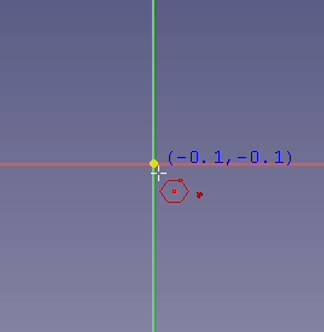

Then click and drag outwards to draw the square. This square will be bound to the centre of the plane

--- /task ---

Next you're going to add some *constraints* to the sketch. This will ensure that it is positioned and orientated correctly, with a defined size. 

You'll notice that in the **Tasks** tab that the square already has some constraints on it.

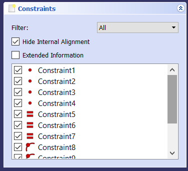

Most of these constraints are to do with the nature of a square. Opposite sides must be parallel and all sides must have the same length, for instance. One constraint you added yourself, by ensuring the square was in the centre of the plane.

You can also see in the **Tasks** tab that your square has *2 degrees of freedom*

This means that you need two additional constraints to fully define the square.

--- task ---
Click on an edge of the square and drag it around. You should see that the square can rotate.

Click on any of the squares edges, then use the **Create a horizontal constraint in the selected item** tool.

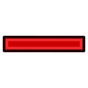

Now the square can't rotate.
--- /task ---

--- task ---
Clicking on an edge and dragging it around, will now cause the square to resize.

Click on an vertical edge and this time use the **Fix the vertical distance between two points or line ends** tool. (It may be in the drop down menu for the constraints. Set the edge length to `15mm`.

--- /task ---

You should see that your square has turned green and the the **Tasks** tab there will be a message saying that the sketch is fully constrained.

--- task ---
To turn this square into a construction geometry, select each of the edges and click on the **Toggle construction geometry** icon.

--- /task ---

The square should turn blue.

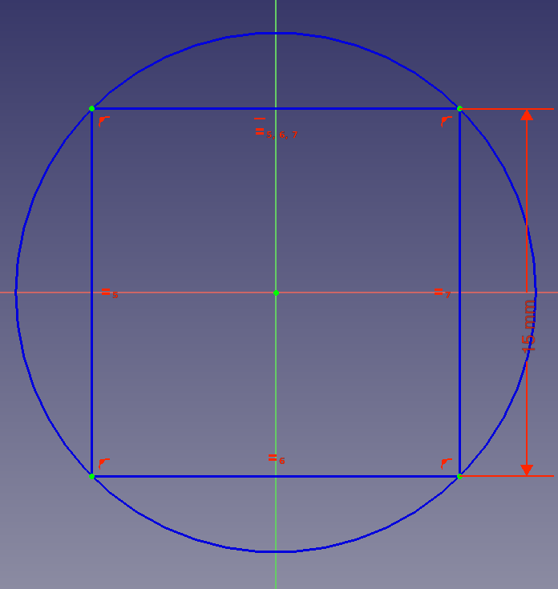

--- task ---
Use the **Create a line in a sketch** tool, to create four diagonal lines within the square. Make sure you're lines are constrained to the construction geometry.

You can ensure the ends of the lines are constrained by hovering over the construction geometry so that the lines turn yellow.

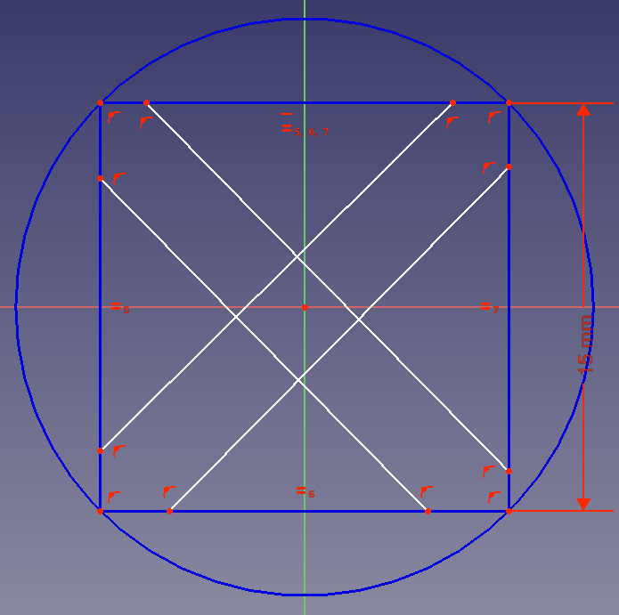
--- /task ---

Sometimes adding lines can add unnecessary constraints to the sketch. To avoid this you can draw lines anywhere in the sketch and then constrain them afterwards.

--- task ---
Draw a small line, anywhere in the sketch, so it's not constrained.

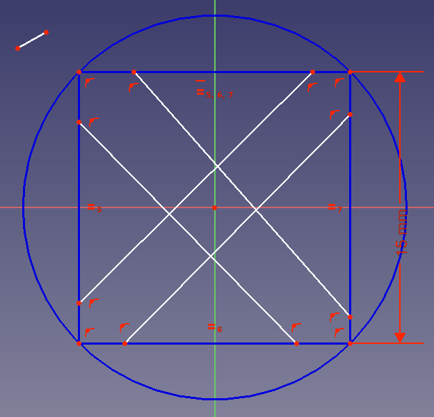
--- /task ---

--- task ---
Use the **Create a coincident constraint** tool to constrain the end points of the line, so that it joins to corner of the construction geometry with the end point of the diagonal line.

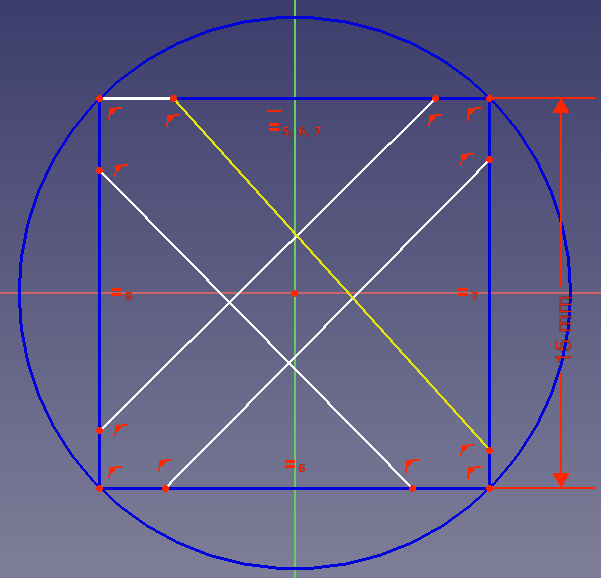
--- /task ---

--- task ---
Repeat this another seven times to create a *pointed cross*-like sketch.

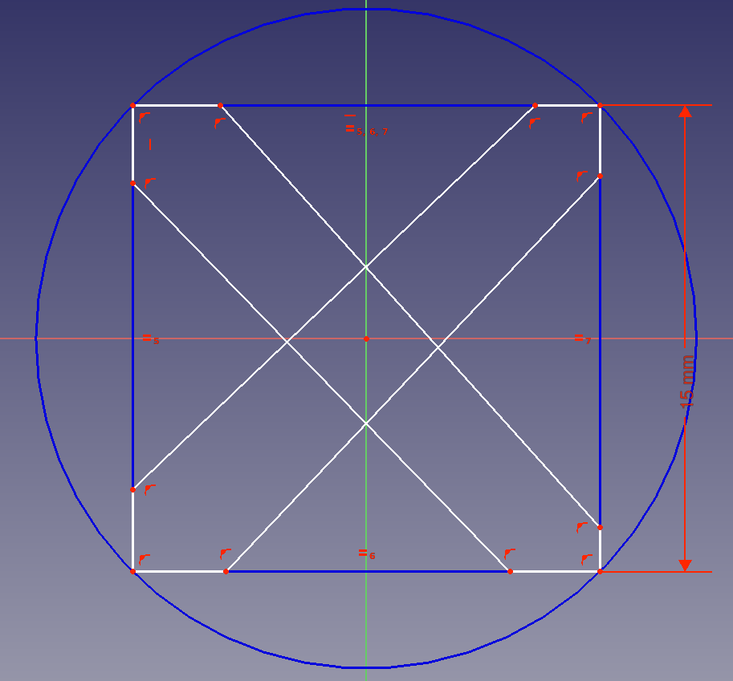
--- /task ---

--- task ---
Select each of the eight lines you have just drawn, and create **equality constraints** between them.

--- /task ---

--- task ---
Now use the **Vertical distance constraint to set the length of one of the vertical lines to 3mm.

Your sketch should become fully constrained - turning completely green. If not, then move some of the points around to discover where you have unconstrained points.

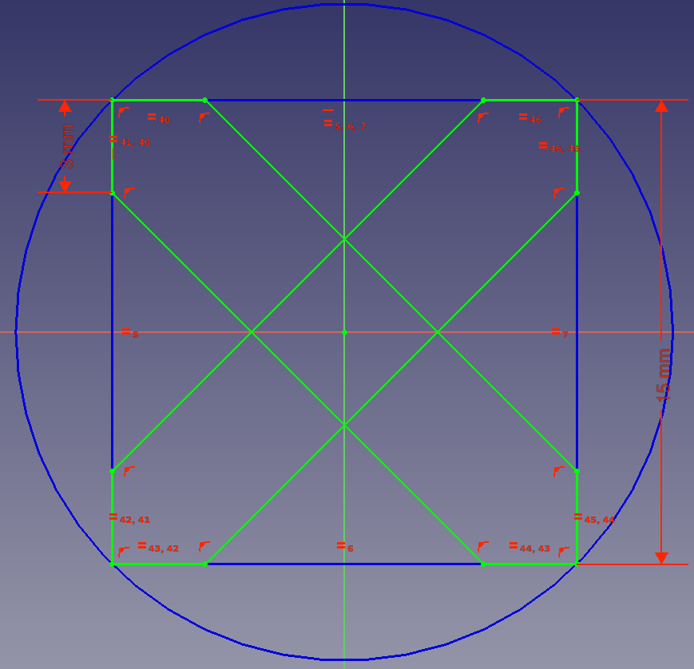
--- /task ---

--- task ---
To finish the sketch you need to remove some of the lines in the centre of the cross.

Use the **Trim** tool and click on the lines in the centre that make up a small square.

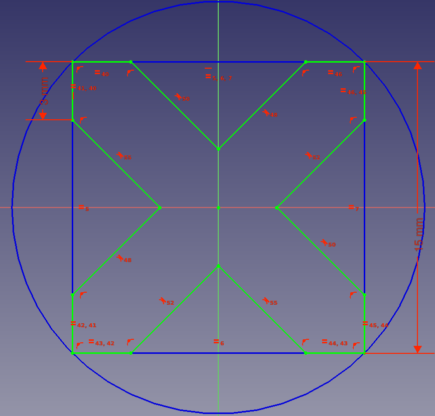
--- /task ---

--- task ---
Click on **Close** in the Tasks tab, to go back to the **Part Design** workbench.
--- /task ---

--- task ---
With your sketch selected, use the **Pad** tool to turn the sketch into a 3D object, with a height of `15mm`

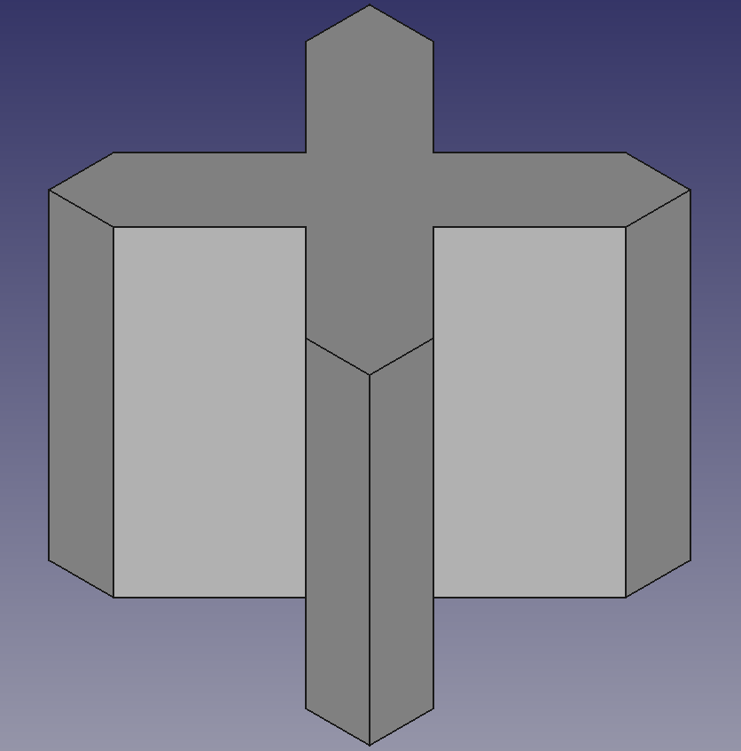
--- /task ---
