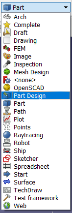
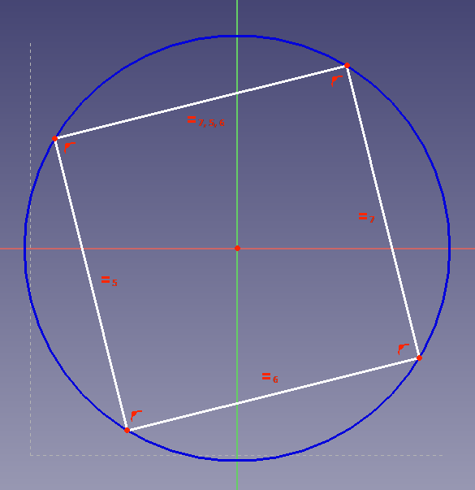

## Bishops

The bishops are the trickiest pieces to make. Rather than trying to make them out of primitive pieces, you're going to use a **Sketch** to describe the shape, and then turn this into a 3D piece.

--- task ---
Create a new file and then switch the workbench to **Part Design**

--- /task ---

--- task ---
Click on the icon to **Create a new body and make it active** and then on **Create a new sketch**

--- /task ---

--- task ---
You will be prompted to select a plane, onto which your new sketch will be mapped, so select the `XY_Plane` and click `OK`.

--- /task ---

You will notice that your workbench changes to the **Sketcher** workbench.

You'll start by making what is called a **Construction Geometry**. Think of these as guide lines, to help you draw an acurate sketch.

--- task ---
Start by using the **Create a square by it's center and by one corner**. You'll want to centre your cursor over the centre of the XY_Plane, so that the red dot in the middle turns yellow.

Then click and drag outwards to draw the square. This square will be bound to the centre of the plane

--- /task ---

Next you're going to add some *constraints* to the sketch. This will ensure that it is positioned and orientated correctly, with a defined size. 

You'll notice that in the **Tasks** tab that the square already has some constraints on it.

Most of these constraints are to do with the nature of a square. Opposite sides must be parrallel and all sides must have the same length, for instance. One constraint you added yourself, byt ensuring the square was in the centre of the plane.

You can also see in the **Tasks** tab that your square has *2 degrees of freedom*

This means that you need two additional constraints to fully define the square.

--- task ---
Click on an edge of the square and drag it around. You should see that the square can rotate.

Click on any of the squares edges, then use the **Create a horizontal constraint in the selected item** tool.

Now the square can't rotate.
--- /task ---

--- task ---
Clicking on an edge and draggin it around, will now cause the square to resize.

Click on an vertical edge and this time use the **Fix the vertical distance between two points or line ends** tool. (It may be in the drop down menu for the constraints.

--- /task ---

You should see that your square has turned green and the the **Tasks** tabe there will be a message saying that the sketch is fully constrained.

