## Make the board

Now, you have produced all of your chess pieces. In this step, you will make the chess board.

--- task ---
Create a new project, then go to the **Part Design** workbench. Create a new body, then create a sketch. Select the **XY_Plane**.
--- /task ---

The board will be made of a base, a top, and four sides. The base and top are identical. Opposite sides are also identical. They will use [finger joints](https://en.wikipedia.org/wiki/Finger_joint){:target="_blank"} to connect to each other.

The instructions below will explain how to create the base/top. Then, you can use sketches of the sides to help you to create the sides independently.

--- task ---
Create a corner rectangle. Put one corner of the rectangle in the centre of the XY_Plane to begin with.

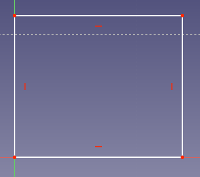
--- /task ---

--- task ---
Give the rectangle horizontal and vertical dimensions of `180mm`. This will make it into a square.

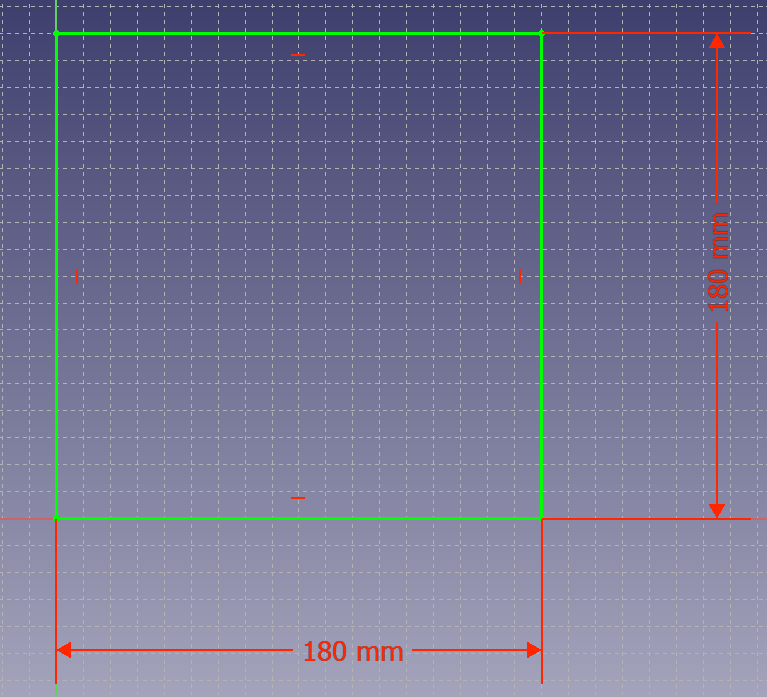
--- /task ---

--- task ---
Now, add four small rectangles along each side of the square. 

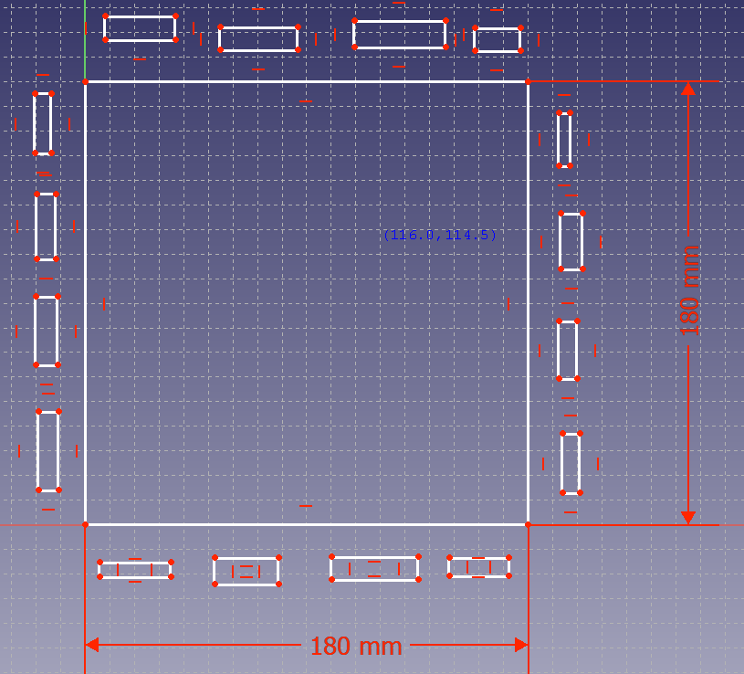
--- /task ---

--- task ---
Use <kbd>Shift</kbd> + click to select one long edge of each of the rectangles, and then add an **Equality constraint** so that they are all the same length.

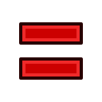

Repeat this with one of the short edges of each of the small rectangles.

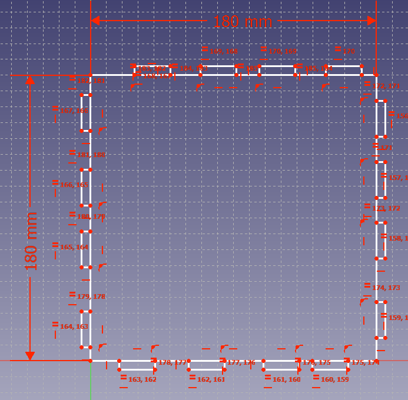
--- /task ---

--- task ---
Set the dimensions of one of the rectangles to `20mm` by `3mm`, and the rest should all adjust to be the same size.

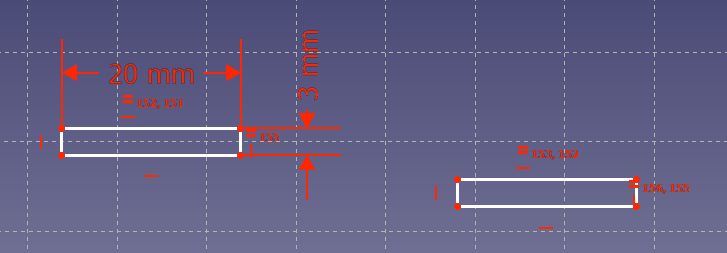

--- /task ---

--- task ---
Select the edges of the rectangles that are closest to the large square and press the <kbd>Delete</kbd> key (<kbd>Fn + Backspace</kbd> on macOS) to remove them.

--- /task ---

--- task ---
Select the two free floating points of one of the rectangles, then use the **Fix a point** tool to constrain them to the closest edge of the square.

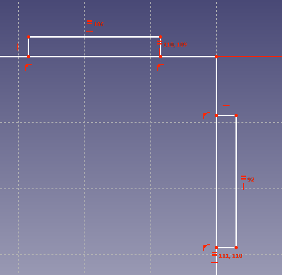

Repeat this for every rectangle.

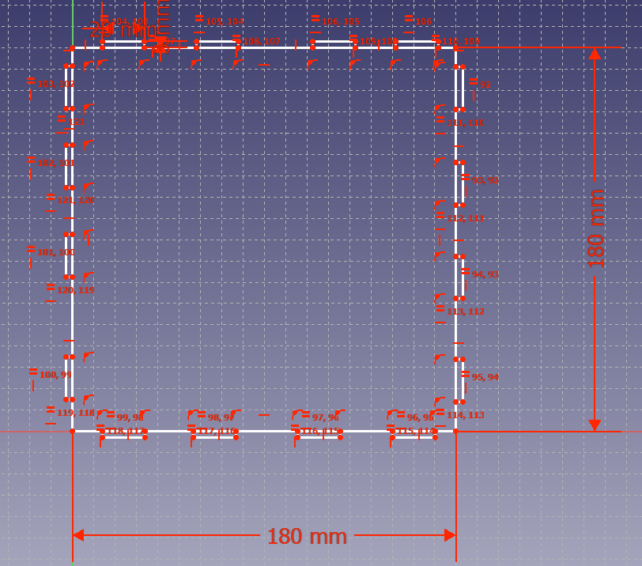
--- /task ---

--- task ---
**Trim** each of the finger joints to remove the lines between the points of the rectangles, where the rectangles join the square.

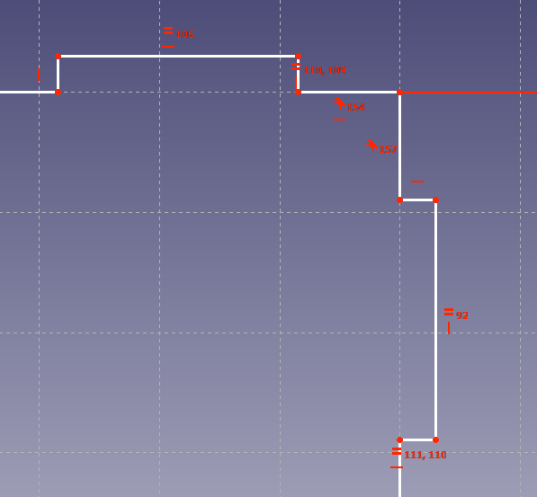

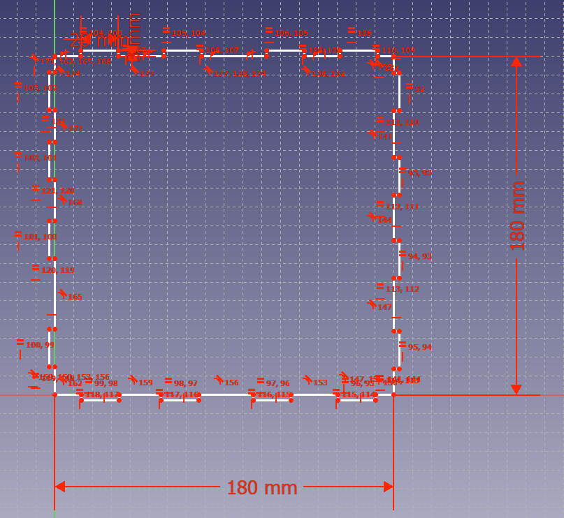

--- /task ---
--- task ---
Select the lines between the finger joints.

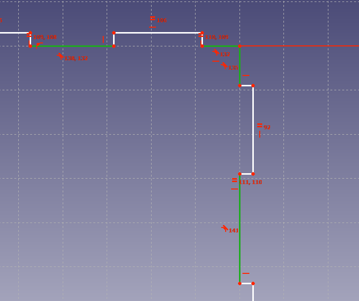

Leave one line free (not selected) on each side of the sketch.

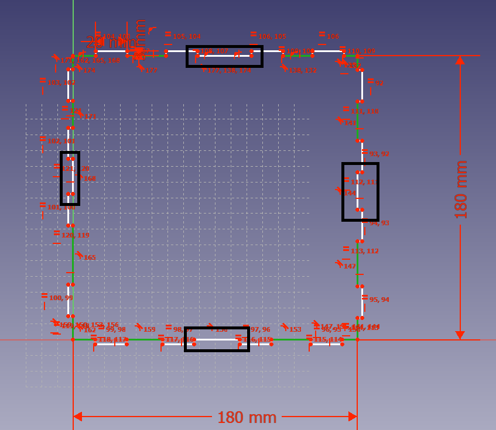

Then, use the **Equality constraint** tool so that each line is the same length.
--- /task ---

--- task ---
To finish the sketch, constrain the length of any of the lines that you had previously selected to `20mm`.

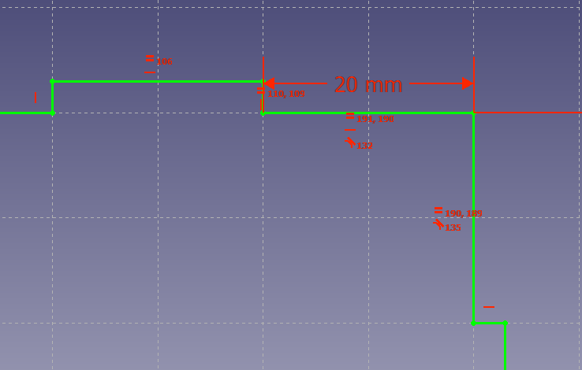
--- /task ---

You should now have a fully constrained base, which should turn green.

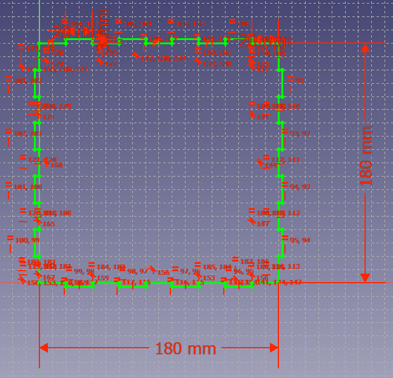

If it is not fully constrained, see which points can be clicked and dragged around, then constrain them.

Now, create the next two pieces in the same way. The sketches below, which include constraints and dimensions, can serve as a guide.

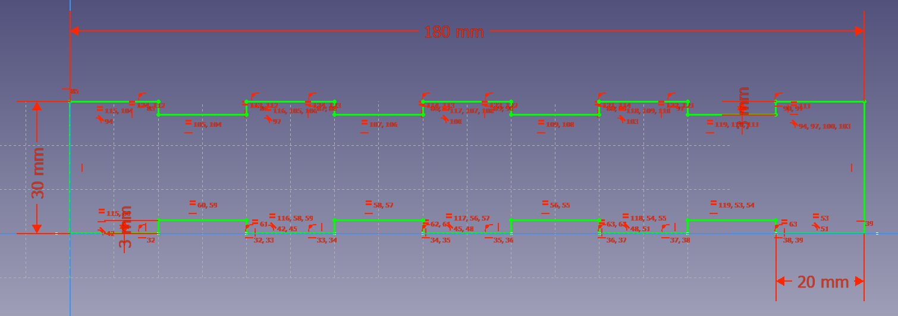
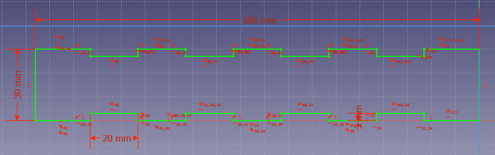
