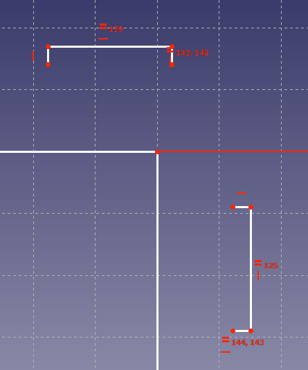

## The board

Now that you have produced all of your chess pieces, it is time to make the board for them.

--- task ---
Create a new project and switch to the **Part Design** workbench. Create a new body and then a sketch.
--- /task ---

The board will be constructed from a base, a top and four sides. The base and top are identical. Opposite pairs of sides are also identical. They will use [finger joints](https://en.wikipedia.org/wiki/Finger_joint){:target="_blank"} to connect to each other.

Instructions will be provided for creating the base/top and then sketches of the sides will be shown, for you to create your own, independently.

--- task ---
Create a corner rectangle, with one corner in the centre of the XY Plane to begin with.

--- /task ---

--- task ---
Give the square horizontal and vertical dimensions of `180mm`

--- /task ---

--- task ---
Now add four small rectangles along each side of the square. 

--- /task ---

--- task ---
Use **Shift** and click to select one long edge of each of the rectangles, and then an **Equality** constraint, so that they are all the same length.

Repeat this with one of the short edges from each of the small rectangles.

--- /task ---

--- task ---
Set the dimensions of one of the rectangles to `20mm` by `3mm`, and the rest should all adjust to be the same size.

--- /task ---

--- task ---
Select the edges of each of the rectangles that are closest to the large square and use the **Delete** key (Fn + Backspace on macOS) to remove them.

--- /task ---

--- task ---
Select the two free floating points of one of the rectangles, and then constrain them to the closest edge of the square, using the **Fix a point** tool.

Repeat this for every rectangle

--- /task ---

--- task ---
Trim each of the finger joints, to remove the lines between the points.

--- /task ---
--- task ---
Select the edges between the finger joints.

Leave one edge free on each side of the sketch.

Then use the **Equality** constraint, so that each is the same length.
--- /task ---

--- task ---
To finish the sketch constrain the length of any of the lines you previously selected to `20mm`.

--- /task ---

You should now have a fully constrained base, that has turned green.

If it is not fully constrained, then see which points can be clicked and dragged around, then constrain them.

The next two pieces are up to you to create in the same way. Below you can see the dimensioned and fully constrained sketches, to use as a guide.

