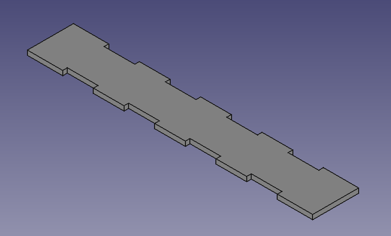

## Manufacturing

There are two ways of making the board - 3D printing or laser cutting.

### 3D printing

--- task ---
For each of your sides and base/top, add a 3mm pad to the sketch, using the **Part Design** workbench.

--- /task ---

--- task ---
Use the file menu to **Export** each piece, choosing an **STL Mesh** as the file type.
--- /task ---

--- task ---
Print each of the pieces twice - a base, a top and four sides.
--- /task ---

### Laser cutting
--- task ---
Open up each sketch using the **Sketcher** workbench. Then use the **File** menu to export each sketch as a **Flattened SVG**
--- /task ---

--- task ---
Open each of the SVG files in Inkscape.

You can check that the scale has been maintained by using the **File** menu to change the **Document Properties**, and altering the units to `mm`

--- /task ---

--- task ---
Press **Shift** + **Ctrl** + **F** with your sketch selected to alter the Fill and Stroke panel.

Different laser cutters require different settings, but most will cut with a stroke width of `0.1`mm and a stroke colour that is `255 Red`.

--- /task ---

This file should now be ready to send to the laser cutter. You need to cut each of the sketches twice.

--- task ---
Optional Task

Before you cut the top of the chessboard, you may want to etch black and white squares. You can use the image below, and place it carefully over the top of the svg.

<html>

</html>
--- /task ---

### The pieces

--- task ---
Export each chess piece as an `STL` file. Instructions are not provided here for 3D printing as printers vary. However [Cura](https://ultimaker.com/software){:target="_blank"} and [Octopi](https://octoprint.org/download/){:target="_blank"} are useful pieces of software to slice and print your models.

Further instructions can be found on how to slice and print models using this software [here](https://projects.raspberrypi.org/en/projects/getting-started-freecad/7){:target="_blank"} and [here](https://projects.raspberrypi.org/en/projects/getting-started-freecad/8){:target="_blank"}
--- /task ---
